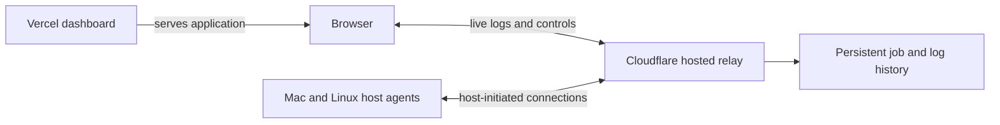
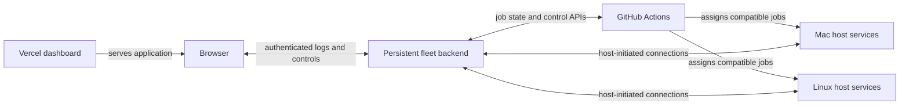

# Fleet connections with a Vercel dashboard

Research snapshot: 2026-09-19. The user selected Vercel for the dashboard and a Cloudflare Worker/Durable Object fleet relay. Other arrangements below are retained for their tradeoffs. No deployment has occurred.

The dashboard will run on Vercel. The user wants browser access from anywhere, live logs, and remote job/host controls, with understandable network allowances and charges. Each CI host should be able to initiate its own authenticated outbound connection; inbound ports on the user's home network are unnecessary for the options below.

## Options

| Arrangement | Published constraints | Tradeoff |
| --- | --- | --- |
| Vercel dashboard plus a small persistent Linux backend | A DigitalOcean Basic example is US$6/month, 1 vCPU, 1 GiB RAM, 25 GiB SSD, and 1,000 GiB outbound transfer; excess outbound is US$0.01/GiB and inbound is free. | Explicit infrastructure allowances, ordinary browser access, and one persistent service for host connections. Requires server maintenance and backups; a single backend is a failure point. This price is not a total product budget or a measured capacity guarantee. |
| Vercel Functions plus external durable state | Current Vercel documentation supports WebSockets in beta with Fluid compute. Connections live only for a Function's maximum duration; reconnects may land on another instance. Durable state must live outside the function. | Uses the existing hosting platform, but requires reconnect/replay and shared storage or messaging, with compute, memory, transfer, and storage usage to price. |
| Vercel dashboard plus a Cloudflare-hosted relay | Workers and Durable Objects can accept browser and host WebSockets; Durable Objects support hibernating idle connections. Workers Paid starts at US$5/month with included allowances; requests, execution/duration, and storage have published usage rates. | No VPS to maintain and no per-machine Tunnel is required when hosts connect outbound to the relay. Durable history and reconnect handling remain application work. Usage is metered, not a fixed all-in price. |
| A backend on owned hardware exposed through Cloudflare Tunnel | Published limits include tunnels and connector replicas. Connector transport connections are not the number of end-user WebSocket sessions. The reviewed Tunnel documentation does not provide a simple monthly transfer allowance/overage schedule comparable to the VPS example. | Outbound-only public reachability, but does not fully resolve the user's concern about pricing and allocation clarity. Backend availability follows the chosen machine. |
| A private backend over Tailscale | Private access requires authorized client devices. Tailscale's public Funnel feature documents non-configurable bandwidth limits. | Appropriate for access from enrolled personal devices; adds a client requirement to browser access. A Vercel frontend does not automatically place Vercel server-side functions inside the private network. |

Sources: [DigitalOcean plans](https://www.digitalocean.com/pricing/droplets), [DigitalOcean transfer billing](https://docs.digitalocean.com/platform/billing/bandwidth/), [Vercel WebSocket support](https://vercel.com/kb/guide/do-vercel-serverless-functions-support-websocket-connections), [Vercel duration limits](https://vercel.com/docs/functions/limitations), [Cloudflare Tunnel](https://developers.cloudflare.com/tunnel/), [Cloudflare account limits](https://developers.cloudflare.com/cloudflare-one/account-limits/), [Tailscale Serve](https://tailscale.com/docs/features/tailscale-serve), [Funnel limitations](https://tailscale.com/docs/features/tailscale-funnel).

Cloudflare-hosted relay references: [Durable Object WebSockets and hibernation](https://developers.cloudflare.com/durable-objects/best-practices/websockets/), [Workers pricing](https://developers.cloudflare.com/workers/platform/pricing/), [Durable Objects pricing](https://developers.cloudflare.com/durable-objects/platform/pricing/).

## Selected Cloudflare direction

The user asked whether the Vercel dashboard could connect to a Cloudflare relay similarly to Pathway. It can. This is a viable alternative to operating a VPS, not evidence that a VPS alternative is unsuitable.

Pathway currently uses Cloudflare Workers for its discovery/authentication API, Convex for relay state, and Cloudflare Tunnel for normal client-to-environment API/WebSocket traffic. A hosted Worker/Durable Object relay that accepts outbound connections from all fleet hosts would be a variation, not an exact reuse of Pathway's traffic path. See [Pathway relay deployment](https://github.com/SpiritDevs/pathway/blob/6590b42077188c0e5e2141fb4b0d584f2413737b/infra/relay/alchemy.run.ts), [relay API](https://github.com/SpiritDevs/pathway/blob/6590b42077188c0e5e2141fb4b0d584f2413737b/infra/relay/src/worker.ts), and [relay README](https://github.com/SpiritDevs/pathway/blob/6590b42077188c0e5e2141fb4b0d584f2413737b/infra/relay/README.md).

The selected architecture is a hosted Worker/Durable Object relay, with persisted metadata and log history independent of any one build machine. The browser receives its application from Vercel and connects directly to the Cloudflare endpoint for live data and controls. Hosts open authenticated outbound connections. GitHub remains responsible for Actions job assignment and authoritative execution state. This removes the need for per-machine public endpoints or a separate VPS, while introducing explicit Cloudflare usage charges. See [ADR 0004](./adr/0004-host-the-fleet-relay-on-cloudflare.md).

Cloudflare Tunnel would reuse more of Pathway's current connection pattern, but would still need an origin service and a decision about shared history while hosts are offline. Reusing Tunnel does not by itself resolve the user's concern about Tunnel transfer allocations. This alternative was not selected.

Vercel documentation is changing: some indexed older pages still say WebSockets are unsupported. The current support page explicitly describes native connections. Actual account availability, runtime requirements, duration, and cost must be checked when preparing deployment; the design cannot rely on an indefinite in-memory function process.

Vercel bills provisioned memory while requests remain in flight, even when CPU work is waiting. Native sockets therefore do not imply free idle connectivity. Network accounting includes both client/CDN and CDN/function transfer, and durable storage is separate. A Vercel-only service is feasible, but a cost estimate needs log volume, viewer activity, batching, and memory measurements. [WebSocket details](https://vercel.com/docs/functions/websockets), [Function pricing](https://vercel.com/docs/functions/usage-and-pricing), [network accounting](https://vercel.com/docs/manage-cdn-usage).

## Considered alternative: a persistent Linux backend

This separates dashboard hosting from the long-lived connection service without changing GitHub's role in execution. It does not require routing all console traffic through Vercel Functions. The backend can also run on an existing suitable server if the user has one.

## Requirements independent of transport

- Live output must be collected after GitHub-equivalent masking and associated with a repository, run, attempt, job, and step. Reliable extraction from the runner remains a feasibility proof; a tunnel alone does not provide it.
- Store ordered output with a resumable cursor. Reconnection must recover acknowledged history and avoid silently duplicating or losing output.
- Console logs have 30-day retention; job metadata and control audit have 90-day retention, with bounded storage.
- Control requests need authorization, acknowledgement, and an audit record. A dashboard must distinguish requested state from state confirmed by GitHub or the host.
- Dedicated, Shared, and Paused are host capacity modes. Pausing admission lets existing jobs finish.
- The host agent's connection and runner-registration credentials belong outside contributed job environments.

Jobs will run natively on enrolled hosts. A minimal official-runner extension is permitted if needed for live-log collection, subject to a feasibility proof and no added paid-service/licensing requirement. No servers have been provisioned and no service has been deployed.
