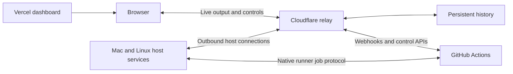

# CI fleet implementation plan

Status: implemented and deployed at SpiritDevs/actions-fleet. Two physical Macs
have executed GitHub jobs concurrently. Pathway's workflow migration is active,
CI validation continues, and signed desktop release validation remains pending.
The npm CLI bootstrap at `0.0.42` is published. See the
[verification record](verification.md) for completed proofs and coverage limits.

## Outcome

Provide a reusable service that executes GitHub Actions jobs on enrolled Macs and Linux hosts, distributes work across compatible available capacity, and exposes live monitoring and remote controls through one dashboard. Pathway is the first migration. Avoid routine Blacksmith/GitHub-hosted build compute; retain an explicit manual hosted fallback.

## Selected design

| Component | Responsibility |
| --- | --- |
| GitHub Actions | Existing workflow triggers, dependencies, checks, job assignment, normal logs, artifacts, and releases. |
| Host service on each Mac/Linux machine | Enroll the host, advertise capabilities, manage native runner execution and capacity, export masked console output, report health, and apply host controls. |
| Vercel dashboard | GitHub login, repository connections, fleet view, job history/details, live console, and remote controls. |
| Cloudflare Worker/Durable Object relay | Authenticate outbound host/browser connections, exchange live events and commands, and coordinate durable history/replay. |
| Persistent metadata and log storage | Retain console output for 30 days and job/control metadata for 90 days, within configurable bounds and independent of any one host. |

Use GitHub's normal App installation and selected-repository configuration across personal accounts and organizations. Installation authority remains subject to each owner's GitHub permissions. Initially only Corey is a dashboard operator; connecting another account's repositories does not grant that account dashboard access. Keep explicit operator membership available for future teammates.

## Execution and controls

- Run jobs natively, with installed toolchains and distinct CI workspaces. No VMs or Kubernetes in the initial implementation.
- Start with one active job per physical host, including across different repository/account registrations. Advertise OS/architecture/tool capabilities accurately; a Linux-only job cannot run on macOS merely because a Mac is idle.
- GitHub assigns jobs to compatible available runners. The host service controls available capacity; it does not promise least-CPU placement or live migration of a running job.
- Dedicated mode supplies configured build capacity. Shared mode moderates admission, process priority, and supported tool concurrency. Paused mode accepts no new work while existing jobs finish. Native Shared mode does not impose a hard memory/CPU sandbox.
- Require maintainer approval for outside-contributor code, bound to the approved revision. Verify the admission gate before enrolling a public repository for execution.
- During a relay outage, active jobs finish and spool logs locally within bounds; admission pauses until reconnect. Restore history from acknowledged sequence positions, and make any storage/collector failure visible.
- Provide run cancellation/force-cancellation, workflow or failed-job reruns, selected-job reruns with their dependent jobs, and host mode controls using GitHub's actual operation scope. Display requested and confirmed state separately.
- Use scoped, revocable host identities. Keep management credentials out of job environments and clean up only job-owned files/processes. Native execution is a trusted-machine model; workspaces and cleanup do not provide VM isolation.

The dashboard will show repository, workflow/job, branch, commit, actor, attempt, status, timing, assigned host, live step output, and host CPU/memory/disk health. Provide filtering, history, control audit, and clear offline/queued/awaiting-approval states. Avoid implying host metrics are isolated per-job measurements.

## Initial Pathway behavior

- Restore the audited automatic triggers and portable jobs on current main, using an isolated checkout rather than changing the user's existing worktree.
- Skip Linux/Windows platform-specific jobs and defer Intel Mac desktop builds. Port portable Ubuntu-labeled release prerequisites and publication steps to macOS.
- Preserve signed/notarized Apple Silicon nightly and stable desktop releases on GitHub, including correct version/channel metadata, updater manifests, asset names, and latest/prerelease handling.
- Preserve the intended Convex/backend and hosted-web channel behavior and stable version-finalization behavior. Validate deployment configuration separately from build-only tests.
- Restore stable npm CLI build/staging on a Mac. Initially publish support for `darwin`/`arm64` only and include the matching resource monitor. The operator approves publication in npm with 2FA; staged and publicly published are distinct outcomes.
- Verify npm package ownership/existence during setup. Bootstrap a first publication if the package does not already exist; staging requires an existing package.
- Keep desktop publication independent of npm approval. Re-enable repository-wide Actions only after migrated routing and triggers are in place, so enabling it cannot restart Blacksmith schedules.

This intentionally narrows Pathway's initial platform coverage. The fleet service itself still supports native Linux hosts from the start. Unmatched jobs in other projects retain normal queuing behavior; the service must not silently skip them.

## Implementation sequence and acceptance

1. **Prove native execution and live console capture.** Build the host foundation and the minimal post-masking runner export, preserving GitHub's normal behavior. Use a dedicated pilot to prove prompt step logs, secret masking, bounded offline spooling/replay, job identity, cancellation, cleanup, and one-job admission. Establish both Mac and Linux execution paths; actual Linux validation needs a Linux host.
2. **Build the hosted service and dashboard.** Implement GitHub identity/installations, host enrollment, metadata reconciliation, relay/storage, fleet/job screens, supported controls, retention, and audit. Demonstrate reconnect recovery and rejection of unauthorized users/hosts.
3. **Enroll the fleet.** Package installation/service startup for macOS and Linux. Inspect the other Macs and any Linux host during enrollment, configure toolchains and modes, and verify restart/reconnect and compatible-job distribution on real machines.
4. **Prepare and validate Pathway migration.** Apply the audited workflow restoration and Mac portability changes in an isolated checkout. Validate check identities, signing/artifact preparation, channels, package metadata, and npm staging behavior before activating recurring production work.
5. **Activate and observe.** Switch the prepared workflows to the fleet, re-enable repository Actions, verify the intended checks and release paths, and measure capacity/log-storage usage. Record the manual hosted fallback and recovery procedure. npm publication is complete only after the operator approves and the registry version is verified.

Detailed checks: [feasibility gates](./feasibility-plan.md). Workflow inventory and release dependencies: [Pathway migration](./pathway-migration.md).

## Cost, recovery, and remaining technical proofs

The goal is to remove routine paid build-runner compute, not to claim zero operating cost. The agreed relay/storage and dashboard hosting have their own account allowances and usage charges; GitHub artifact/cache storage, electricity, and any rented Linux machine remain separate. Use bounded storage and measured usage. The existing Pathway Vercel deploy currently requests a Vercel-side build; moving its Actions job alone does not relocate that separate build compute.

If capacity is unavailable, jobs wait within GitHub's queue limits. Recovery defaults to pausing admission and repairing the fleet; use hosted execution only through the agreed explicit manual switch. Keep migration changes reversible and do not make rollback automatically restore Blacksmith billing or publish another release.

The [verification record](./verification.md) tracks completed implementation
proofs separately from this plan. Two physical M2 Max Macs have been enrolled
and exercised concurrently, including Shared admission and a successful Pathway
Release Smoke job on the Xcode-equipped host. Native Linux support remains
unverified on a physical Linux machine. Release/signing and project-wide checks
need their own evidence; a fleet pilot does not establish their outcome.
Provider/account credentials stay in their normal configuration flows; no
secret values belong in these documents.

The user confirmed the design and authorized implementation, deployment, and the public repository. A native Mac menu bar app supplements the web dashboard with connection state, current work, local pause/resume, and a quit action that leaves the host service running.
